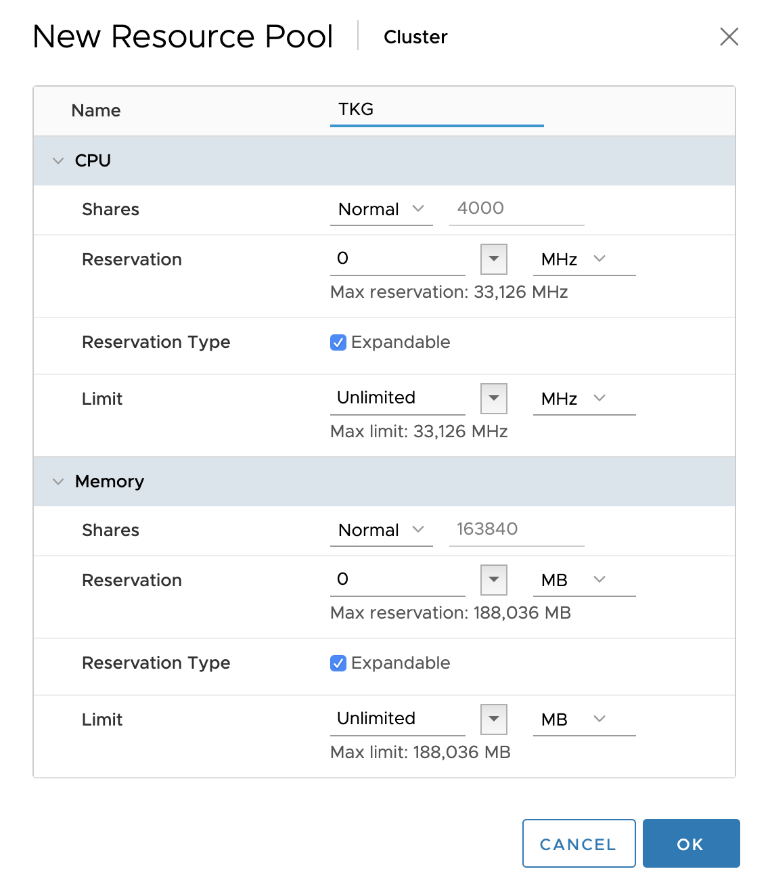
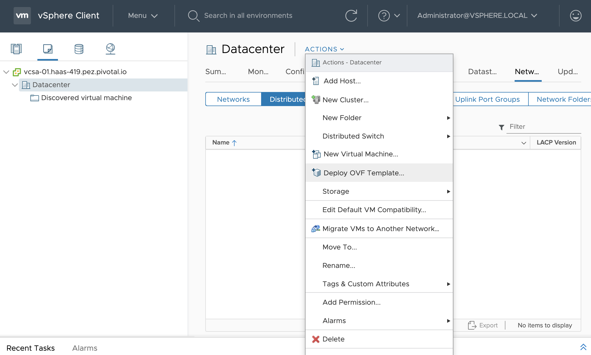
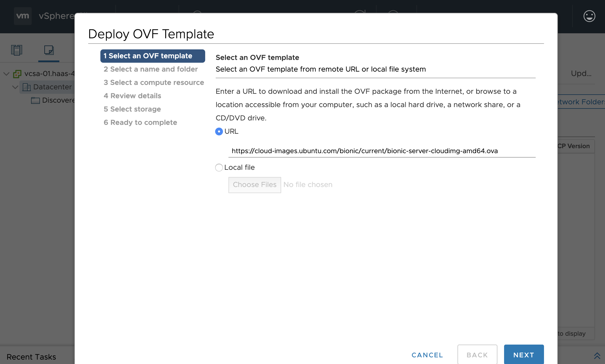
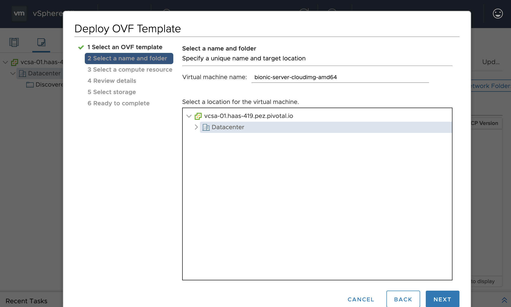
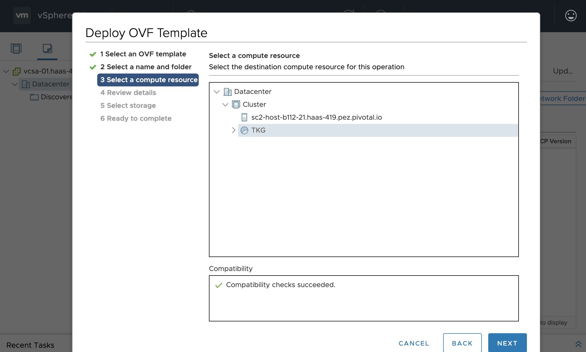
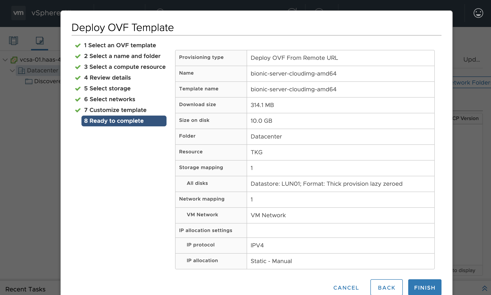
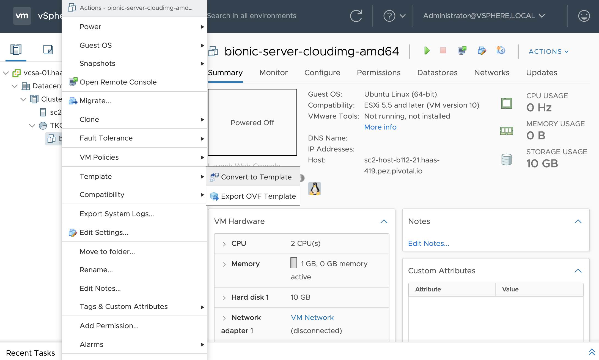
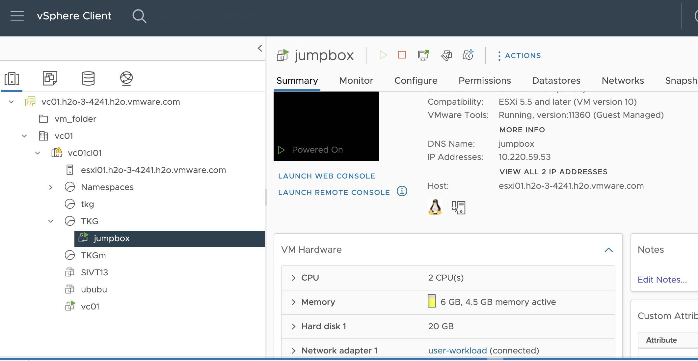
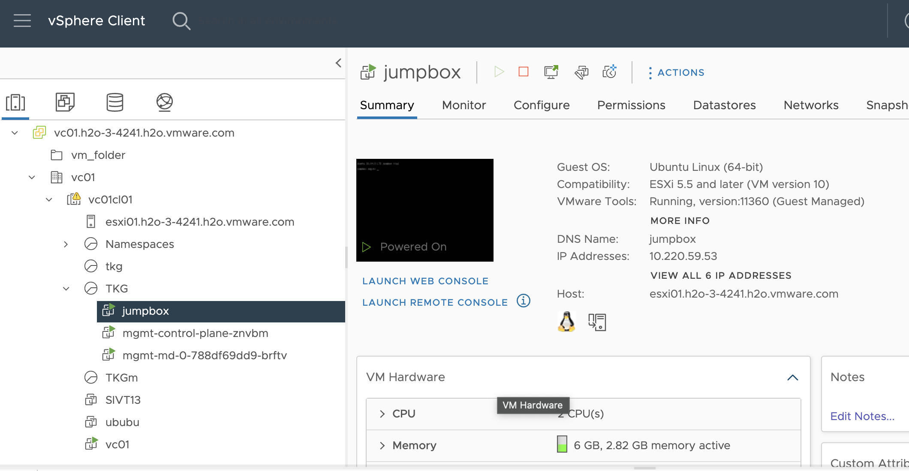
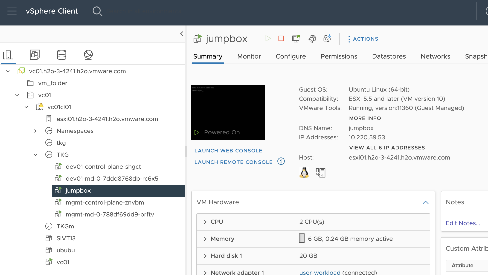

# Terraforming vSphere for Tanzu Kubernetes Grid (TKG)

Use this repository to deploy [TKG](https://tanzu.vmware.com/kubernetes-grid)
to vSphere 6.7u3, leveraging these Terraform scripts.

This repository is also compatible with
[Tanzu Community Edition](https://tanzucommunityedition.io) (TCE),
the open source version of TKG.

## Files Explanation

env.tpl -> Variable definition file for:
  HTTP_PROXY_HOST=${http_proxy_host}
  HTTP_PROXY_PORT=${http_proxy_port}
  CONTROL_PLANE_ENDPOINT=${control_plane_endpoint}
  
govc.tpl  -> Variable definition file for govc integration (APIs toward vSphere)
  export GOVC_URL=${vsphere_server}
  export GOVC_USERNAME=${vsphere_user}
  export GOVC_PASSWORD=${vsphere_password}
  export GOVC_INSECURE=true

main.tf -> pointers to vsphere provider:
  provider "vsphere" {
    user                 = var.vsphere_user
    password             = var.vsphere_password
    vsphere_server       = var.vsphere_server
    allow_unverified_ssl = true
  }
  
setup-jumpbox.sh -> bash script to install all required software for bootstrap vm. Read through the script to customize or disaable any componenet

terraform.tfstate -> autopopulated file with terraform state once executed

terraform.tfvars -> file with details of vsphere environment (below my last lab details)
  vsphere_password = "!8D1ixprxA6KmzPWB3M"
  vsphere_user	 = "administrator@vsphere.local"
  vsphere_server   = "vc01.h2o-3-4241.h2o.vmware.com"
  network          = "user-workload"
  datastore_url    = "ds:///vmfs/volumes/vsan:529aba229313b8dc-1115c743db4b2b62"
  datacenter       = "vc01"
  datastore        = "vsanDatastore"
  tanzu_cli_file_name = "tanzu-cli-bundle-linux-amd64.tar.gz"
  cluster           = "vc01cl01"
  vm_folder         = "tkg"
  # Management control plane endpoint.
  control_plane_endpoint = "10.220.59.35" #Static IP that has to be defined upfront from the workload network

tkg-cluster.yml.tpl -> definition file for TKGm deployment
  CLUSTER_PLAN: dev
  INFRASTRUCTURE_PROVIDER: vsphere
  IDENTITY_MANAGEMENT_TYPE: none
  ENABLE_CEIP_PARTICIPATION: "false"
  VSPHERE_SERVER: "${vcenter_server}"
  VSPHERE_USERNAME: "${vcenter_user}"
  VSPHERE_PASSWORD: "${vcenter_password}"
  VSPHERE_DATACENTER: "${datacenter}"
  VSPHERE_DATASTORE: "${datastore}"
  VSPHERE_NETWORK: "${network}"
  VSPHERE_RESOURCE_POOL: "${resource_pool}"
  VSPHERE_FOLDER: "${vm_folder}"
  VSPHERE_INSECURE: "true"
  CLUSTER_CIDR: 100.96.0.0/11
  SERVICE_CIDR: 100.64.0.0/13
  CONTROLPLANE_SIZE: "medium"
  WORKER_SIZE: "medium"
  OS_NAME: "ubuntu"
  
variables.tf -> variables type and default values definition
vm-jumpbox.tf -> list of steps for jumpbox creation inside vsphere and copy of all needed files for TKG deployment operated from jumphost itself

## Prerequisites

### Download components

Download TKG bits to your workstation. The following components are required:

- Tanzu CLI for Linux: includes the `tanzu` CLI used to operate TKG and workload clusters from the jumpbox VM
- OS node OVA: used for TKG nodes (based on Photon OS and Ubuntu)
- [Ubuntu server cloud image OVA](https://cloud-images.ubuntu.com/focal/current/focal-server-cloudimg-amd64.ova): used for the jumpbox VM

Make sure to copy the Tanzu CLI archive (`tanzu-cli-bundle-*.tar`) to this repository.

### Prepare vSphere infrastructure

First, make sure DHCP is enabled: this service is required for all TKG nodes.

Create a resource pool under the cluster where TKG is deployed to: use name `TKG`.



All TKG VMs will be deployed to this resource pool.

You need to deploy all OVA files as OVF templates to vSphere.

Repeat the next steps for each OVA file:











All OVA files will be uploaded to your vSphere instance as new VMs.
**Make sure you do not start any of these VMs**.

You can now convert each of these VMs to templates:



### Create Terraform configuration

Starting from `terraform.tfvars.tpl`, create new file `terraform.tfvars`:

```yaml
vsphere_password = "changeme"
vsphere_server   = "vcsa.mydomain.com"
network          = "net"
datastore_url    = "ds:///vmfs/volumes/changeme/"

# Management control plane endpoint.
control_plane_endpoint = 192.168.100.1
```

As specified in the [TKG documentation](https://docs.vmware.com/en/VMware-Tanzu-Kubernetes-Grid/1.4/vmware-tanzu-kubernetes-grid-14/GUID-mgmt-clusters-vsphere.html#kubevip-and-nsx-advanced-load-balancer-for-vsphere-2),
you need to use a static IP for the control plane of the management cluster.
Make sure that this IP address is in the same subnet as the DHCP range, but do not choose
an IP address in the DHCP range.

Please note that you can also use these Terraform scripts to deploy
[Tanzu Community Edition](https://tanzucommunityedition.io) (TCE),
the open source version of TKG.
All you need to do is to copy the TCE bundle archive in this directory
(`tce-linux-amd64-X.tar.gz`), and set this property in your `terraform.tfvars` file:

```yaml
tanzu_cli_file_name = "tce-linux-amd64-v0.9.1.tar.gz"
```

## Bootstrap the jumpbox

First, initialize Terraform with required plugins:
```bash
$ terraform init
```

Run this command to create a jumpbox VM using Terraform:
```bash
$ terraform apply
```

Using the jumpbox, you'll be able to interact with TKG using the `tanzu` CLI.
You'll also use this jumpbox to connect to nodes using SSH.

Deploying the jumpbox VM takes less than 5 minutes.

At the end of this process, you can retrieve the jumpbox IP address:
```bash
$ terraform output jumpbox_ip_address
10.160.28.120
```



You may connect to the jumpbox VM using account `ubuntu`.

## Deploy TKG management cluster

Connect to the jumpbox VM using SSH:
```bash
$ ssh ubuntu@$(terraform output jumpbox_ip_address)
```

A default configuration for the management cluster has been generated in
the file `.config/tanzu/tkg/clusterconfigs/mgmt-cluster-config.yaml`.
You may want to edit this file before creating the management cluster.

Create the TKG management cluster:
```bash
$ tanzu management-cluster create --file $HOME/.config/tanzu/tkg/clusterconfigs/mgmt-cluster-config.yaml
```

This process takes less than 10 minutes.

In case you get the error:
  Error: unable to set up management cluster: unable to build management cluster configuration: unable to get template: 
  - assert.fail: fail: missing configuration variables: VSPHERE_PASSWORD

  Create a new user with appropriate rights and assign a password without "strange" characters and encode it with:
    echo -n 'my-string' | base64
  then, replace username and password in ~/.config/tanzu/tkg/config.yaml:
    VSPHERE_USERNAME: "your_new_user"
    VSPHERE_PASSWORD: "<encoded:your_encoded_password"
    


## Create TKG workload clusters

You can now create workload clusters.

Create a cluster configuration file in `.config/tanzu/tkg/clusterconfigs`.

You may reuse the content from the management cluster configuration file,
adjusting the control plane endpoint
(do not pick the same IP address used for the management cluster!):

```yaml
CLUSTER_NAME: dev01
CLUSTER_PLAN: dev
VSPHERE_CONTROL_PLANE_ENDPOINT: "10.220.59.40"
```

Create the workload cluster:
```bash
$ tanzu cluster create --file $HOME/.config/tanzu/tkg/clusterconfigs/dev01-cluster-config.yaml
```

This process takes less than 5 minutes.



Create a `kubeconfig` file to access your workload cluster:
```bash
$ tanzu cluster kubeconfig get dev01 --admin --export-file dev01.kubeconfig
```

You can now use this file to access your workload cluster:
```bash
$ KUBECONFIG=dev01.kubeconfig kubectl get nodes
NAME                          STATUS   ROLES    AGE     VERSION
dev01-control-plane-r5nwl     Ready    master   10m     v1.17.3+vmware.2
dev01-md-0-65bc768c89-xjn7h   Ready    <none>   9m44s   v1.17.3+vmware.2
```

Copy this file to your workstation to access the cluster
without using the jumpbox VM.

**Tips** - use this command to merge 2 or more `kubeconfig` files:
```bash
$ KUBECONFIG=dev01.kubeconfig:dev02.kubeconfig kubectl config view --flatten > merged.kubeconfig
```

You may connect to a TKG node using this command (from the jumpbox VM):
```bash
$ ssh capv@node_ip_address
```

Use this command to add more nodes to your workload cluster (from the jumpbox VM):
```bash
$ tanzu cluster scale dev01 --worker-machine-count 3
```

## Connect your workload cluster to a vSphere datastore

The workload cluster you created already includes a vSphere CSI.

The only thing you need to do is to apply a configuration file, designating the
vSphere datastore to use when creating Kubernetes persistent volumes.
The file is located in this repository and has to be run from personal workstation.

Use generated file `vsphere-storageclass.yml`:
```bash
$ KUBECONFIG=dev01.kubeconfig kubectl apply -f vsphere-storageclass.yml
```

or from jumphost if `vsphere-storageclass.yml` has been copied over:
```bash
$ kubectl apply -f vsphere-storageclass.yml
```

You're done with TKG deployment. Enjoy!

## Contribute

Contributions are always welcome!

Feel free to open issues & send PR.

## License

Copyright &copy; 2022 [VMware, Inc. or its affiliates](https://vmware.com).

This project is licensed under the [Apache Software License version 2.0](https://www.apache.org/licenses/LICENSE-2.0).
